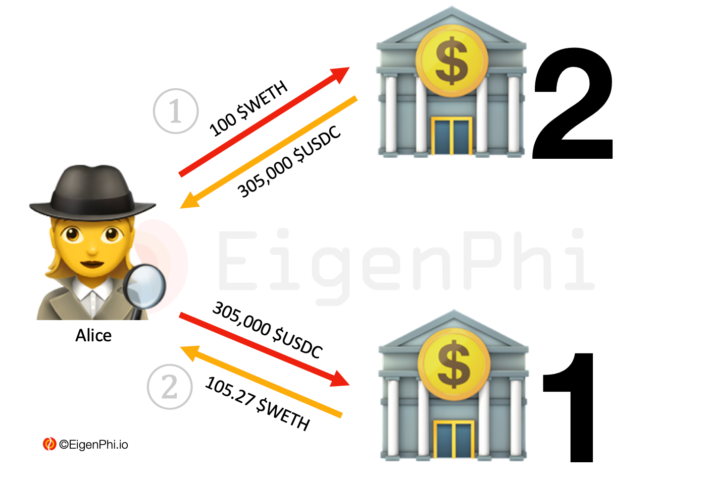

# Arbitrage Between 2 Pools

We will start with the simplest arbitrage, which is the most straightforward incarnation of "buy low and sell high."  

For the sake of clarity, we will use liquidity pools, LP, to refer to different kinds of trading venues.

Searchers undertake two transactions involving two tokens between two liquidity pools utilizing the exchange rate spread of the tokens. 

Here comes Alice. Being a searcher, she finds the exchange rate of $USDC for $WETH in a liquidity pool--called LP1- on UniSwap v3 is 2,900:1, which means 2,900 $USDC for 1 $WETH. Meanwhile, the exchange rate of the same pair in another liquidity pool--called LP2--on UniSwap v3 is 3,050:1, which means 1 $WETH can exchange for 3,050 $USDC. 

Alice sees an arbitrage opportunity here: the price of $WETH for $USDC in LP2 is lower than in LP1. Here is what Alican does: 

Alice sells 100 $WETH in LP2 and receives 305,000 $USDC. 

Alice sells 305,000 $USDC in LP1 and receives 105.27 $WETH. 

Now the arbitrage is done, and Alice's revenue is 5.27 $WETH, resulting from 105.27 $WETH minus 100 $WETH. 

The cost of this arbitrage is the gas fees of the two transactions Alice paid to the network. Let's assume it is 0.01 $WETH. Then the profit Alice reaped from this arbitrage is 5.26 $WETH, resulting from 5.27 $WETH minus 0.01 $WETH. 

After having some basic ideas about arbitrage, let's move on to more complicated ones.