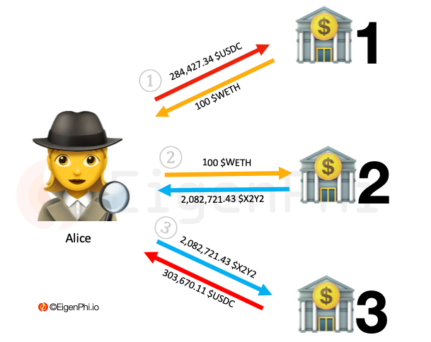

# Arbitrage Between 3 Pools

In the 🔄 **3 Pools Arbitrage** section, you'll find setups for triangular arbitrage opportunities using three different trading pools.

The essence of earning is simple: exploit price differences across three different pools using three different assets. This creates a circular trading opportunity where the final amount exceeds the initial investment.

---

### **Arbitrage Formats**:
🏊‍♂️🏊‍♂️🏊‍♂️ **DEX-DEX-DEX**: Three pools on decentralized exchanges
🏊‍♂️🏊‍♂️📈 **DEX-DEX-CEX**: Two DEX pools and one centralized exchange
🏊‍♂️📈📈 **DEX-CEX-CEX**: One DEX pool and two centralized exchanges
📈📈📈 **CEX-CEX-CEX**: Three different centralized exchanges

---

### **Key Considerations**:

- **Gas Fees**
  With three transactions required, gas costs become even more critical to profitability.

- **Price Impact**
  Each trade affects subsequent pool prices, requiring careful size calculation.

- **Execution Speed**
  All three trades must complete quickly before prices change.

- **Asset Selection**
  Choose liquid pairs to minimize slippage across all three trades.

---

### **How Does 3 Pools Arbitrage Work?**

Let's look at a practical example using USDC → WETH → X2Y2 → USDC:

1. Trade 1: Sell 284,427.34 USDC for 100 WETH (Rate: 1 WETH = 2,844.27 USDC)
2. Trade 2: Sell 100 WETH for 2,082,721.43 X2Y2 (Rate: 1 WETH = 20,827.21 X2Y2)
3. Trade 3: Sell 2,082,721.43 X2Y2 for 303,670.11 USDC

Initial: 284,427.34 USDC
Final: 303,670.11 USDC
Profit: 19,242.77 USDC (minus gas fees ≈ 150 USD)

---

### **How to Earn Consistently?**
💵 [Learn advanced triangular arbitrage strategies and setups](https://t.me/send?start=SBPVQk0nep5lgxZDIy)
💵 [Get access to real-time 3-pool arbitrage opportunities](https://t.me/send?start=SBPVQk0nep5lgxZDIy)
