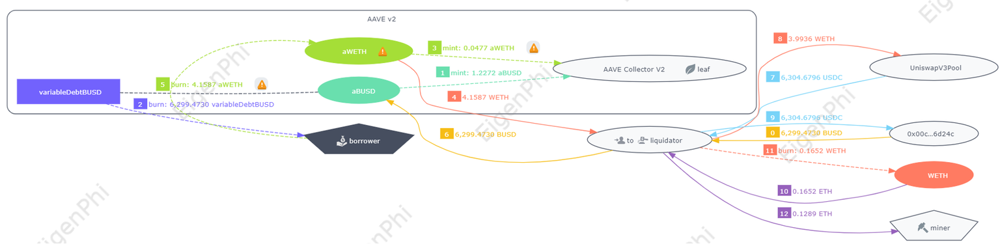

# Liquidation transaction with Aave V2 involved

Let's look at a simple liquidation transaction.

This transaction involves Aave V2, so we can see that transfers within the Aave protocol are all grouped together. 

To get the collateral, the liquidator have to cover the debt for the borrower. In the sixth step, the liquidator settled the debt of 6299 BUSD for the borrower. 

In the second step, we can see that 6,299 virtual debt BUSD has been burned, you can think of it as the IOU of the borrower in Aave. 

In return, the liquidator got the borrower's collateral, 4.1587 WETH. 

Correspondingly, the same amount aWETH, the collateral certificate, was burned from the borrower in the 5th step. 

